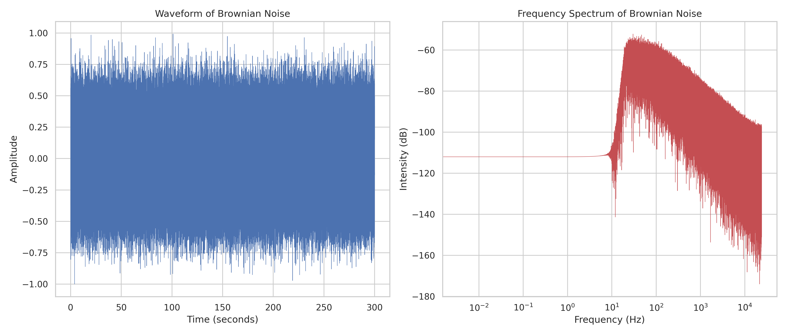

# Brown Noise Generator

The "relaxing noise" mixer app I have is missing brown noise, so I made my own. It is super fast if you don't tack on `-p` / `--plot`. 

```bash
> pip install -r requirements.txt
> python gen_brownian.py -l 300 -f brown_noise.wav -sr 48000 -hp 20
```



```bash
> python gen_brownian.py --help
usage: gen_brownian.py [-h] [--length LENGTH] [--sample_rate SAMPLE_RATE] [--file_name FILE_NAME] [--plot] [--plot_file_name PLOT_FILE_NAME] [--f3dB F3DB] [--highpass HIGHPASS] [--no-highpass]

Generate and process Brownian noise.

options:
  -h, --help            show this help message and exit
  --length LENGTH       Length of the noise in seconds.
  --sample_rate SAMPLE_RATE
                        Sample rate in Hz. [44100, 48000, 96000, etc]
  --file_name FILE_NAME
                        Output file name.
  --plot                Specify this flag to save a plot.
  --plot_file_name PLOT_FILE_NAME
                        File name for saving the plot if plot is enabled.
  --f3dB F3DB           f3dB cutoff frequency in Hz (basically another high pass filter) 
  --highpass HIGHPASS   High pass filter cutoff frequency in Hz
  --no-highpass         Disable high pass filtering.
```

## License
Distributed under the MIT License. See `LICENSE` for more information.

## References
- [@Pidud_ for help with math](https://twitter.com/Pidud_)
- [Brownian noise](https://en.wikipedia.org/wiki/Brownian_noise)
- [Exponential moving average cut-off frequency](https://dsp.stackexchange.com/questions/40462/exponential-moving-average-cut-off-frequency/40465#40465)
